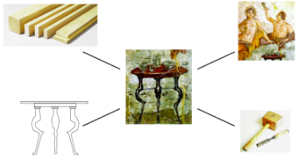
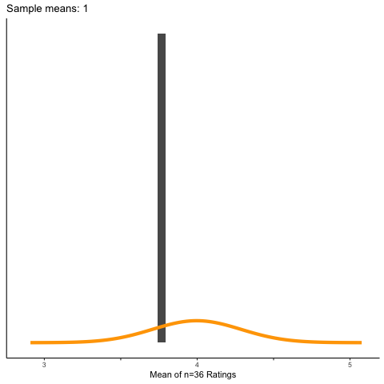
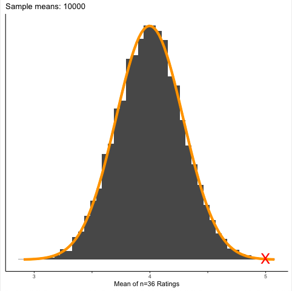
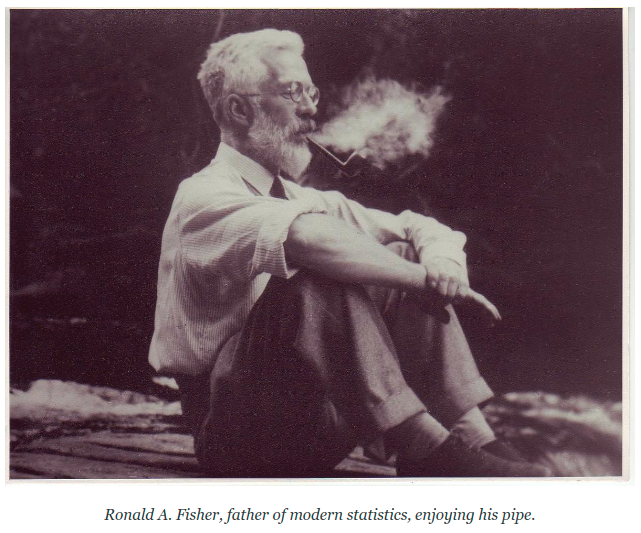
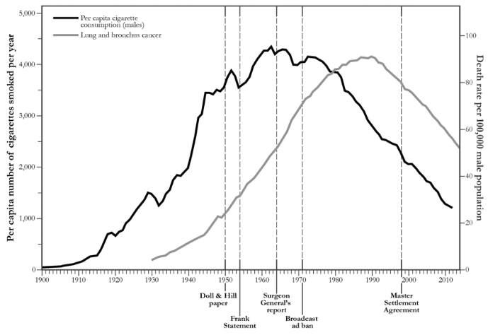
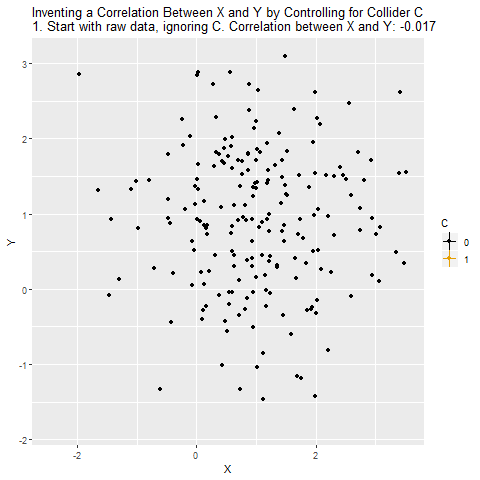

class: center, middle

```{r setup, include=FALSE}
options(htmltools.dir.version = FALSE)
knitr::opts_chunk$set(echo = FALSE, eval = TRUE,fig.align="center",warning=F,message=F,fig.width=6, fig.height=4)
mykable <- function(x, align = "c", digits=3, format="html",...) {
  knitr::kable(x, align = align, digits=digits, format=format, ...)
}
library(knitr)
#library(xaringanthemer)
#mono_accent(
# base_color = "#bf5700",
#  #header_font_google = google_font("Josefin Sans"),
#  #text_font_google   = google_font("Montserrat", "300", "300i"),
#  code_font_google   = google_font("Droid Mono")
#)

hook_output <- knit_hooks$get("output")
knit_hooks$set(output = function(x, options) {
  lines <- options$output.lines
  if (is.null(lines)) {
    return(hook_output(x, options))  # pass to default hook
  }
  x <- unlist(strsplit(x, "\n"))
  more <- "..."
  if (length(lines)==1) {        # first n lines
    if (length(x) > lines) {
      # truncate the output, but add ....
      x <- c(head(x, lines), more)
    }
  } else {
    x <- c(more, x[lines], more)
  }
  # paste these lines together
  x <- paste(c(x, ""), collapse = "\n")
  hook_output(x, options)
})
```

---
class: center, middle, inverse

## Day 1: Causality, Experiments, Validity


---

# Causal inference

.center[]


- Many of our questions are causal

    - do changes in one variable *cause* changes in another? 
    - if so, why?

- Only recently has science acquired mathematical formalisms for expressing these questions (and tools that let us use data to answer them!) 

- Until recently, such questions were off-limits, as they must inherently go "beyond the data"

- Questions must be cast as associational in order to be analyzed mathematically

---

# Causal inference

- A paradigm shift is happening, thanks to researchers like Pearl, Glymour, Halpern, Robins, Winship, Rubin, King, et al.

- Big Data will not solve our problems: data can tell you *what*, but not *why*

- "Data mining" can only summarize associations: Causal questions require causal models! 

- OK to speak about cause and effect, so long as you make your assumptions transparent to others!

- 🔥Causal inference🔥 —*so hot right now*!

    + In the 2003 JSM, only 13 papers had "cause/causal"
    + In 2014, the number exceeded 100

--

> *"More has been learned about causal inference in the last few decades than the sum total of everything that had been learned about it in all prior recorded history"*  &nbsp; &nbsp; &nbsp; -Gary King    

--

- But this excitement is barely seen among statistics educators, textbooks

--

- If causality mentioned at all, just RCTs or "correlation $\ne$ causation"

---

### What does it mean for something to cause something else?

- Really, what does it mean to you?

--

- ... this is not an easy question!

--

- People have been grappling with this concept for centuries!

--

- We think of a cause a something that *makes a difference*
- ...and the difference it makes must be otherwise than what would've happened without it!

--

- Thus, we must simulate a mental model of reality in which the cause was absent and imagine the consequences
- This sort of *counterfactual* reasoning underlies most modern approaches to causal inference!


---

## A Brief History of Causation

> "I would rather discover one cause than be the King of Persia" -Democritus (c. 430 BC)

--


- Thucydides, the ancient Greek historian, describes a tsunami in 426 BC

> "About the time that these earthquakes were so common, the sea...returned in a huge wave...so that what was once land is now sea; such of the inhabitants perishing as could not run up to the higher ground... The cause of this phenomenon must be sought in the earthquake. At the point where its shock has been the most violent the sea is drivenback, and suddenly recoiling with redoubled force, causes the inundation. *Without an earthquake I do not see how such an accident could happen.*"

--

- About a century before Aristotle, the anonymous author of the Hippocratic text *On Ancient Medicine* had described the essential characteristics of a cause: 

> "We must, therefore, consider the causes of each [medical] condition to be those things which are such that, when they are present, the condition necessarily occurs, but when they change to another combination, it ceases."

--

- What do these have in common?


---

## A Brief History of Causation

- But to the ancients, Aristotle was the authority on Causation
- For him, a cause is an answer to a "Why?" question
- Four explanatory modes (material, formal, final, and efficient causes) <br><br>


```{R fig.width=4, fig.height=5}
library(knitr)

```

--

- But nowhere in his writings does he mention counterfactuals!

---

> "For all sad words of tongue and pen, The saddest are these:  
*It might have been*" &nbsp; &nbsp; &nbsp; &nbsp; &nbsp; &nbsp; &nbsp; &nbsp;- John Greenleaf Whittier (1856)

### The Ladder of Causation

1. Seeing (associations between $X$ and $Y$)

    - Detecting regularities in our environment

2. Doing (intervening on $X$, seeing what happens to $Y$)

    - Anticipating effects of deliberate actions on environment to achieve an outcome
    - E.g., intentional use of tools

3. Imagining (mentally simulating interventions on $X$ and comparing the results)

    - Ability to represent other "possible worlds" (*what might have been*) 
    - Possible worlds constrained by causal models (we usually don't imagine nonsense worlds)
    - Separates us from other animals who can only see *what is* and *what has been*


> “Counterfactuals are the building blocks of moral behavior as well as scientific thought. The ability to reflect on one’s past actions and envision alternative scenarios is the basis of free will and social responsibility. The algorithmization of counterfactuals invites thinking machines to benefit from this ability and participate in this (until now) uniquely human way of thinking about the world.” - Judea Pearl

---

## Hume's Regularity Theory (1739)

It is impossible to observe a causal connection: however, when A and B always cooccur ("constant conjunction"), happen very close together in time ("contiguity"), and the cause A always precedes the effect B ("temporal priority"), we *think* a causal connection exists

--

#### Hume's definition of a cause:

1. "An object precedent and contiguous to another, and where all the objects resembling the former are placed in like relations of precedence and contiguity to those objects that resemble the latter."  

--

1. "An object precedent and contiguous to another, and so united with it, that the idea of the one determined the mind to form the idea of the other, and the impression of the one to form a more lively idea of the other."    


---
class: invert

```{R}
library(knitr)

```

--

#### Fortunately, Hume changed his mind:

>“*We may define a cause to be an object followed by another... where, if the first object had not been, the second never had existed*” (1748, Section VII). 

---

## Counterfactual theories

- Literally, a *counterfactual* is something that is contrary to fact

- What would have happened if you could turn back time and remove a putative cause (e.g., what if the patient had *not* received treatment)?

--

- A **causal effect** is the difference between what did happen and what would have otherwise happened

    + that is, the difference between the outcome when treatment was applied and the outcome when it was not

--

- Unfortunately, we cannot observe a counterfactual...   

    + an individual cannot simultaneously receive and *not* receive treatment

---

## Counterfactual reasoning & hypothesis testing

- Hypothesis testing uses *data* from a sample to draw conclusions about a larger population

- Not about *causation* but about *extrapolation* (does a difference in your sample indicate a difference in the population?)

- As a tool, it has its share of critics...

- But it works, and I find the underlying reasons rather beautiful

- And counterfactual reasoning plays a crucial, often-overlooked role! 

---

## Hypothesis testing and counterfactuals

#### Austin paper claims that students are neutral about scooters on campus

- You randomly sample $n=36$ students and ask them their opinion
- 7-point scale: 1 (*strongly opposed*) to 7 (*strongly in favor*)
- You find that the mean rating is $\bar x = 5$, standard deviation of $s=3$

#### Is this evidence that students are *not* neutral? 

- We ask, "how likely are we to get a sample mean $\bar x=5$ *if the true mean was* $\mu=4$?"
- Here, the true mean $\mu$ is the average rating across every student in the population

#### It turns out that means of random samples follow a nice distribution!

- If the true mean was really $4$, we know the distribution of *all possible sample means* is normal
- Specifically, the CLT tells us it's roughly $N(\mu,s/\sqrt{n})=N(4,\frac 12)$

#### We can see this by imagining a population where $\mu=4$ and ploting the distribution of all possible means $n=36$

---


.center[]

- Reach into the population, grab $n=36$ people, take the average rating, plot it...
- Repeat 10000x!

---
class: center, middle, inverse

## In a world where $\mu=4$, how likely would we be to get a sample where $\bar x=5$?

---

.center[]

- Red X shows that a value this large is *very unusual* if the true mean is 4!
- Thus, the true mean is *very unlikely to be 4*!


---

## Counterfactual reasoning

#### A central task of causal inference is to create reasonable approximations to this physically impossible counterfactual!

More about this very soon, but first: let's try to **define causation**

We say that $X$ is a cause of $Y$ when...

if we were to intervene and change the value of $X$ without changing anything else, then $Y$ would also change as a result

---
## Necessary Cause

$$
X \longrightarrow Y
$$

- If we say $X$ is a necessary cause of $Y$  

    + then observing $Y$ implies that $X$ happened to cause it.
    + however, observing $X$ does not imply that $Y$ will occur.    

--

- For example, a gunshot is a necessary cause of a gunshot wound

--

- Lawyer's use this criterion for guilt: the injury would not have occurred *but for* the accused's actions
- We will see later how to estimate the probability that the accused is guilty!


---
## Sufficient Cause

$$
X \longrightarrow Y
$$

- If we say $X$ is a sufficient cause of $Y$  

    + then observing $X$ implies that $Y$ will happen as an effect.
    + however, observing $Y$ does not imply that $X$ had occurred.  

--

- Throwing a brick at a window is a sufficient cause of a crack

--

- When multiple factors have a causal influence on something, they are contributory causes: not sufficient (need other factors), may be necessary.

--

- We will distinguish this from necessary causation and see how to estimate these probabilities too

---

##Consider the cause of a forest fire 

.center[]

---

##Consider the cause of a forest fire

- Different potential causes (cigarette, lightning, campfire): *none necessary*

- *None sufficient*: weather must be dry, cigarette must stay lit, must contact combustible material, must be oxygen...

- Cigarette part of a set of conditions without which a fire will not result

- Cigarette is "an Insufficient but Nonredundant part of an Unnecessary but Sufficient condition" (an INUS condition)

    
---

### Why is this important to keep in mind?

- Drug called Endostatin developed to shrink tumors by limiting their blood supply (Folkman, 1996)

- Other researchers could not replicate, even when using Endostatin shipped from Folkman's lab.

- Finally able to replicate the effect after traveling to Folkman's lab and learning how to manufacture, store, and handle the drug, and how to inject it at the right location, depth, and angle.

- Endostatin was an INUS condition: an insufficient cause, whose effectiveness required it to be embedded in a larger set of conditions

---

## Why is this important to keep in mind?

- Most causes are more accurately INUS conditions: many factors are required for an effect to occur, but we rarely know all of them or how they relate.

- To different degrees, all causal relationships are context dependent, so generalization of experimental effects is always an issue.

- We try to deal with this messiness by conducting controlled experiments

- The key to estimating causal effects lies in understanding the principles of randomized experiments


---
## The Experiment

Examining the consequences of deliberately varying a potential causal agent

--

**Requires, at a minimum:**

1. Variation in treatment 

2. Post-treatment measures of outcome 

3. At least one unit on which observation is made 

4. A mechanism for inferring what the outcome would have been without treatment

---
## Experiments: the best tool for studying causal relationships

- We manipulate the presumed cause and observe an outcome

- We see whether variation in the cause is related to variation in the effect

- We use techniques to reduce the plausibility of other explanations for the effect...along with techinques to explore the plausibility of explanations we cannot rule out

- In a **true experiment**, this mechanism is random assigment of units to treatment and control conditions

---
## Randomization

Randomized experiments were invented by Ronald Fisher in the early 1920s

- Researching effects of different fertilizers (e.g., Fertilizers 1 and 2) by applying them to different fields (Fields A and B, respectively)

- Fisher realized that if crops grew better in Field A, you couldn't be sure if Fertilizer 1 was better: perhaps Field A had richer soil to begin with!

- The effect of fertilizer was "confounded" by preexisting differences among the fields themselves

---
## Confounding variable


```{R fig.width=5, fig.height=3.2}
library(ggdag)

coords <- tibble::tribble(
  ~name,            ~x,  ~y,
  "X",    0,   0,
  "Y",    1,   0,
  "Z",    .5,   1,
)

ggdag(dagify(Y ~ X,X~Z,Y~Z, coords=coords,labels=c(X="Fertilizer",Y="Yield",Z="Soil Quality, etc.")),use_labels="label")+theme_dag_blank()
```

In the data, the raw relationship between `Fertilizer` and `Yield` reflects (1) the effect of interest, and (2) the way `Soil Quality` affects both!

---
## The birth of the randomized experiment

- Fisher divided the fields into small plots, assigned fertilizers to each *at random*

- Thus, plots that got Fertilizer A were, on average, identical to those that got Fertilizer B!
    


  
---
## Random assignment

- The hallmark of a true experiment is random assignment

- Random assignment creates two or more groups of units that are similar to each other on average

- Thus, any outcome differences observed between groups are likely due to treatment (and not to preexisting differences)

> Imagine assigning fertilizers to subplots randomly 100 times: sometimes you might assign Fertilizer 1 to the best subplots, other times you might assign it to the worst subplots. But most of the time Fertilizers 1 and 2 will be assigned to plots that are representative of the field as a whole (i.e., equal on average)

---
## Randomization breaks confounding!

```{R fig.width=5, fig.height=3.2}
library(ggdag)

coords <- tibble::tribble(
  ~name,            ~x,  ~y,
  "X",    0,   0,
  "Y",    1,   0,
  "R", 0,   .5,
  "Z",    .5,   1,
)

ggdag(dagify(Y ~ X,X~R,Y~Z, coords=coords,labels=c(X="Fertilizer",Y="Yield",Z="Soil Quality, etc.",R="Random process (e.g., coin-flip)")),use_labels="label")+theme_dag_blank()
```

- Randomization "blocks the back door" from X to Y

- It severs *every* incoming link to the randomized variable 
- Thus it eliminates *all possible confounders* of the $X\rightarrow Y$ relationship (including ones we don't know about or can't measure)!

- This is why randomized controlled trials (RCTs) are the "Gold Standard"

- But there are other ways of identifying causal effects!

    - What if you cannot manipulate the cause?
    - What if it is unethical to manipulate the cause?
    - What if it is very difficult to conduct such a trial?


---

## Manipulable Causes

**Non-manipulable events:** supernova, natural disaster, stock-market crash...

--

**Non-manipulable attributes:** age, biological sex, height, "IQ", smoking...

- Because we cannot manipulate them, it is much more difficult to discover their effects.


---
class: center, middle



---
## Smoking and Lung Cancer


- In the mid-1700s, James Lind discovered that 🍊🍋 prevents scurvy  

    + Vitamin C deficiency necessary and sufficient to produce scurvy
    
--

- In the mid-1850s, John Snow discovered that 💩-contaminated water causes cholera (more about this story later)

    + Cholera bacillus necessary and sufficient to produce cholera  
    
--

- In the mid-1950s, lung cancer was ravaging the UK
    
    + Smoking not sufficient (many who smoke don't get cancer)
    + Smoking not necessary (many get cancer without ever smoking)
    

> Between 1900 and 1950, lung cancer quadrupled and frequency to become the most common cancer in mean. Why?

--

- Smoking rates increased rapidly in the early 1900s
- For example, by 1950 over 40% of Americans smoked!  

---

.center[]

- But timeseries data are poor evidence of causality
- Lots of other things had changed since 1900 that were plausible culprits
    
    + *paved roads (tar), car exhaust, gas fumes, power plant emissions...*

---

## The Case-Control Study

- Hill and Doll (1950) compared cancer patients to healthy volunteers
- Interviewed 1500 people, about $\frac 12$ of whom had lung cancer:

    + Asked about family medical history, jobs, hobbies, diet, residence...
    + Interviewers were blind to who had cancer
    
- Found smokers were 9x more likely to have lung cancer
- Also found that prevalance rose with quantity smoked

### Many reasons for bias, however
- Participants knew whether they had cancer, which may affect responses
- Hospialized cancer patients not representative of the population

---

## The Prospective Study

In 1951, Hill and Doll sent questionnaires to 60,000 people about their smoking habits and then followed them forward in time

- After just 5 years, found that heavy smokers' death rate from lung cancer was over 25x nonsmokers'
- Found that quitting smoking reduced lung-cancer death risk by 2x
- Dose-response effect: $\uparrow smoking$, $\uparrow risk$; $\ \downarrow smoking$, $\downarrow risk$ 

### Skeptics still unconvinced...

- Fisher demanded a randomized experiment as the standard of proof
- Otherwise, he claimed, you can't rule out *confounding variables*
- Smokers may differ genetically from non-smokers (e.g., riskier behavior)
- These behaviors might affect health outcomes regardless of smoking

---

## Confounding variables

```{R echo=F, fig.width=4, fig.height=3}
library(dplyr)
library(ggplot2)
library(ggdag)
library(dagitty)

coords <- tibble::tribble(
  ~name,            ~x,  ~y,
  "Y",    2,   0,
  "Z",    1,   1,
  "X",    0,   0
)

tidy_ggdag <- dagify(Y~X,Y~Z,X~Z,
             exposure = "X",
             outcome = "Y",coords = coords,labels=c(X="Smoking",Y="Lung Cancer",Z="Smoking Gene")) %>% tidy_dagitty()

ggdag(tidy_ggdag,use_labels="label",label_size = 15)
```


- Since you can't randomly assign people to smoke, you cannot break the link
- But there has to be another way! 

---
## Role of experiments

1. Test links in the chain
2. Test competing explanatory theories 
3. Test if relationship moderated by another variable
4. Test if new links need to be added (mediators)

--

- Randomized experiments are an ingenious way to separate correlation from cause. But the smoking controversy reveals how, in certain situations, randomized experiments are not possible. 

- Yet obviously causation is at work. How can we measure it? 


---

## Detour into DAGs (causal graphs)

- We have to have a model to get at causality!

    - A correlation summarizes a relationship...
    - But it can't tell you whether X causes Y, or Y causes X, or...

- A model is what we think the data-generating process is

- Once we have a model, it will tell us how to find a causal effect (if it's possible)

- A very helpful way to specify a model is with a causal diagram

    - Include the important factors (nodes) and what you think causes what (arrows)
    - This model encodes all of your assumptions about how the data was produced
    - Lets you figure out what you need to do to find your causal effect of interest

---

## Causal Diagrams

- They encode (hypothetical) causal relationships among our variables

#### Types of junctions

```{R fig.width=12, fig.height=3.3}
library(gridExtra)

tidy_ggdag <- dagify(y~z,z~x,
             exposure = "x",
             outcome = "y") %>% tidy_dagitty(layout="linear")
p1<-ggdag(tidy_ggdag) +
  theme_dag_blank()+ggtitle("Chain")

dag1<-confounder_triangle()
p2<-ggdag(dag1)+theme_dag_blank()+ggtitle("Fork/Confounder")

dag1<-collider_triangle()
p3<-ggdag(dag1)+theme_dag_blank()+ggtitle("Collider")

grid.arrange(p1,p2,p3,nrow=1)
```

--

#### Three Rules that Stop the Flow of Information

1. In a **chain**, controlling for *z* prevents info about *x* from getting to *y* (or vice versa)
2. In a **fork**, controlling for *z* prevents info about *x* from getting to *y*  (or vice versa)
3. In a **collider**, it's the *exact opposite*: *x* and *y* start out independent (no flow), but if you control for *z* they become dependent (information flows through)

- **If a single junction is blocked, the whole path is blocked!**
- Controlling for descendents/proxies is like *partially* controlling for the variable itself

---

## Practice 1

```{R echo=F, fig.width=6, fig.height=3}

coords <- tibble::tribble(
  ~name,            ~x,  ~y,
  "Y",    2,   1,
  "A",    1,   1,
  "X",    0,   1,
  "B",    1,   0,
)

tidy_ggdag <- dagify(Y~A,A~X,B~A,
             exposure = "X",
             outcome = "Y",coords = coords) %>% tidy_dagitty()

ggdag(tidy_ggdag) +
  theme_dag_blank()
```

#### What variables do you need to control for to unconfound the $X\rightarrow Y$ relationship?

--

- **Easy: no back-door paths, so none!**

--

- Don't control for B! (Some of the effect of X on Y happens through B)!

--

- In the original, $X=smoking$, $Y=miscarriage$, $A=smoking\text{-}related\ abnormality$ (unobservable), $B=history\ of\ miscarriages$

---

## Practice 2

```{R echo=F, fig.width=6, fig.height=4}
coords <- tibble::tribble(
  ~name,            ~y,  ~x,
  "X",          0,   0,
  "E",          0,   1,
  "Y",          0,   2,
  "A",     1,   0,
  "B",          1,   1,
  "C",        1,   2,
  "D",        .5,   1
)


tidy_ggdag <- dagify(Y~E,X~A,B~D+A,E~D+X,C~B,
             exposure = "X",
             outcome = "Y",coords=coords) %>% tidy_dagitty(layout="mds")

ggdag(tidy_ggdag,edge_type="link") +
  theme_dag_blank()
```

#### What variables do you need to control for to unconfound the $X\rightarrow Y$ relationship?

--

- **Another trick: You don't need to control for anything!**
    
    - Don't control for B (or C): you open up a non-causal path!
    - If you did, you could re-close the path by controlling for A or D
    - All of this is unnecessary though: the back-door path is closed!

???

- In the original, $X=currently\ smoking$, $Y=miscarriage$, $A=smoked\ during\ first\ pregnancy$
$B\ and\ E =smoking\text{-}related\ abnormalities$ (unobservable), $C=prior \ miscarriage$

---
## Practice 3

```{R echo=F, fig.width=6, fig.height=4}

tidy_ggdag <- dagify(Y~X+B,X~B,A~B+X,
             exposure = "X",
             outcome = "Y") %>% tidy_dagitty(layout="mds")

ggdag(tidy_ggdag,edge_type="link") +
  theme_dag_blank()
```

#### What variables do you need to control for to unconfound the $X\rightarrow Y$ relationship?

--

- **Control for B (not A)**

---

## Practice 4
```{R echo=F, fig.width=6, fig.height=4}
coords <- tibble::tribble(
  ~name,            ~y,  ~x,
  "X",          0,   0,
  "Y",          0,   1,
  "A",          1,   0,
  "B",          .5,   .5,
  "C",        1,   1,
)


tidy_ggdag <- dagify(X~A, B~A, B~C,Y~C,Y~X,
             exposure = "X",
             outcome = "Y",coords=coords) %>% tidy_dagitty(layout="mds")

ggdag(tidy_ggdag,edge_type="link") +
  theme_dag_blank()
```

#### What variables do you need to control for to unconfound the $X\rightarrow Y$ relationship?

--

- Only one back-door path, blocked by B, so we **don't need to control for anything**
- X and Y become confounded if you control for B!
- Most researchers would control for B!


---
## M-Bias Example
```{R echo=F, fig.width=6, fig.height=4}
m_bias(x = "Education", y = "Diabetes", a = "Income during Childhood", 
       b = "Genetic Risk \nfor Diabetes", m = "Mother's Diabetes") %>% 
  ggdag(use_labels = "label")+theme_dag_blank()
```


---
## M-Bias Example 2
```{R echo=F, fig.width=6, fig.height=4}
m_bias(x = "Smoking", y = "Lung Disease", a = "Attitude towards Norms", 
       b = "Safety/Health Measures", m = "Seatbelt Usage") %>% 
  ggdag(use_labels = "label")+theme_dag_blank()
```


---
## Practice 5
```{R echo=F, fig.width=6, fig.height=4}
coords <- tibble::tribble(
  ~name,            ~y,  ~x,
  "X",          0,   0,
  "Y",          0,   1,
  "A",          1,   0,
  "B",          .5,   .5,
  "C",        1,   1,
)


tidy_ggdag <- dagify(X~A, B~A, B~C,Y~C,X~B,Y~X,
             exposure = "X",
             outcome = "Y",coords=coords) %>% tidy_dagitty(layout="mds")

ggdag(tidy_ggdag,edge_type="link") +
  theme_dag_blank()
```

#### What variables do you need to control for to unconfound the $X\rightarrow Y$ relationship?

--

- **Control for C (easiest)!**
- Control for *B* but that opens the M-shaped path, so must also control for *A* or *C*

---
### Worked Example

- You collect some data on **ice cream sales** and **swimming pool deaths**  
- You find that the two are strongly correlated!

```{R echo=T}
library(ggplot2)
dat<-read.csv("https://tinyurl.com/SSI-Causal/icecream_deaths.csv")

cor(dat$icecream,dat$pooldeaths)

ggplot(dat,aes(y=pooldeaths,x=icecream))+geom_point()
```


---

## But does this model of the world make any sense?

```{R}
tidy_ggdag <- dagify(y~x,
             exposure = "x",
             outcome = "y",labels=c(x="Ice Cream Sales",y="Swimming Pool Deaths"),coords=tibble::tribble(
  ~name,            ~x,  ~y,
  "y",    1,   0,
  "x",    0,   .5))

ggdag(tidy_ggdag,use_labels="label") +
  theme_dag_blank()
```

---
## No!

- If we were to sit down and write a model, we might assume something like this

```{R, fig.height=3.5, fig.width=5}
tidy_ggdag <- dagify(y~z+x,x~z,
             exposure = "x",
             outcome = "y",labels=c(x="Ice Cream Sales",y="Swimming Pool Deaths",z="Temperature"),coords=tibble::tribble(
  ~name,            ~x,  ~y,
  "y",    1,   0,
  "x",    0,   0,
  "z",    .5,  1))

ggdag(tidy_ggdag,use_labels="label")+theme_dag_blank()
```

--

- Much more plausible that the observed relationship is a spurious correlation induced by `temperature`
- Temperature likely affects both icecream sales and swimming pool deaths
- We wouldn't expect a relationship between `icecream` and `pooldeaths` *a priori*
- If we remove the effect of temperature from each, there should be no correlation

```{R echo=T}
icecream_notemp <- summary(lm(icecream~temp, data=dat))$residuals
pooldeaths_notemp <- summary(lm(pooldeaths~temp, data=dat))$residuals
cor(icecream_notemp, pooldeaths_notemp)
```

## Confounding and Controlling

```{R echo=F, fig.width=6, fig.height=5}
library(dplyr)
library(ggplot2)
library(ggdag)
library(dagitty)

coords <- tibble::tribble(
  ~name,            ~x,  ~y,
  "Y",    2,   0,
  "Z",    1,   1,
  "X",    0,   0,
)

tidy_ggdag <- dagify(Y~X,Y~Z,X~Z,
             exposure = "X",
             outcome = "Y",coords = coords,labels=c(X="Ice Cream Sales",Y="Pool Deaths",Z="Temperature")) %>% tidy_dagitty()

ggdag(tidy_ggdag,use_labels="label",label_size = 15)
```


- A *back-door path* is any path from X to Y that starts with an arrow *into* X

--

- These are paths that allow for spurious correlations between X and Y!

--

- To *deconfound* X and Y, we must block every backdoor path 

---
## More Practice: Confounding and Controlling

- We think that `BMI` has an effect of `Glucose`

- We could just look at the relationship between them in the data...

- But say there's some other variable that affects both (e.g., `Diabetic Status`)

- Thus, the *raw* relationship between reflects the way $X$ affects $Y$ (what we want), and also the way that $Z$ affects both $X$ and $Y$

```{R}
coords <- tibble::tribble(
  ~name,            ~x,  ~y,
  "Y",    2,   0,
  "Z",    1,   1,
  "X",    0,   0,
)

tidy_ggdag <- dagify(Y~X,Y~Z,X~Z,
             exposure = "X",
             outcome = "Y",coords = coords,labels=c(X="BMI",Y="Blood Glucose",Z="Diabetic Status")) %>% tidy_dagitty()

ggdag(tidy_ggdag,use_labels="label",label_size = 15)
```


---
## Confounding and Controlling 

```{R echo=T}
library(dplyr)    #run install.packages("dplyr") first to install
library(ggplot2)  #run install.packages("ggplot2") first to install
select <- dplyr::select 
```

--

```{R, echo=T, eval=F}
meddat<-read.csv("https://tinyurl.com/SSI-Causal/MedicalData.csv")
med<-meddat %>% select(BMI,Glucose,Diabetic)
med<-med %>% group_by(Diabetic) %>% mutate(AvgByDiabetic = mean(Glucose))
```

--

```{R}
meddat<-read.csv("../MedicalData.csv")
med<-meddat%>%select(BMI,Glucose,Diabetic)
med<-med%>%group_by(Diabetic)%>%mutate(AvgByDiabetic = mean(Glucose))
med%>%head()%>%mykable(format="html")
```

---
## Variation Explained

- `AvgByDiabetic` represents the part of `Glucose` that is *explained* by `Diabetic`
- Whatever is left over (i.e., "the residual") must be the part *unexplained* by `Diabetic`

--

```{R, echo=T}
med<-med %>% group_by(Diabetic) %>% mutate(ResidualGlucose = Glucose-AvgByDiabetic)
```

--

```{R}
med%>%mykable(format="html")
```

---
## Variation Explained

- How much of `Glucose` is explained by `Diabetic` status?
- We see how much *variance* is left over!

```{R echo=T, eval=F}
med %>% ungroup() %>% summarize(var(Glucose), var(ResidualGlucose), 
                                var(ResidualGlucose)/var(Glucose))
```

```{R}
med %>% ungroup() %>% summarize(var(Glucose), var(ResidualGlucose), 
                                var(ResidualGlucose)/var(Glucose))%>%mykable(format="html")

```

--

- 82.67% of the variation in `Glucose` is left after removing the effect of `Diabetic`
- Thus, `Diabetic` status explained about 17.33%! 

---

## Confounding and Controlling

- Imagine we want to look at the effect of `BMI` on blood `Glucose`

```{R, echo=T, output.lines=-c(1:4,6:9)}
ggplot(med,aes(BMI,Glucose))+geom_point()
cor.test(med$BMI,med$Glucose)
```

---

## Confounding and Controlling

- Ah, but we know `Diabetic` status influences `BMI` and `Glucose`!

```{R, echo=T}
ggplot(med,aes(BMI,Glucose,color=Diabetic))+geom_point()+theme(legend.position=c(.92,.86))
```

---

## Confounding and Controlling

We can *control for* `Diabetic` status and see if this relationship still holds

> "What is the replationship between `BMI` and `Glucose` *after removing the parts that are explained by* `Diabetic Status`"

--

1. Use `Diabetic` to explain `Glucose` and take the residual

2. Use `Diabetic` to explain `BMI` and take the residual

3. The relationship between the residual `Glucose` and the residual `BMI` is the effect of interest!

--

```{R, echo=T}
med <- med %>% group_by(Diabetic) %>% mutate(ResidualBMI = BMI - mean(BMI)) 

cor.test(med$ResidualGlucose,med$ResidualBMI)
```

---

## Controlling, visualized

.pull-left[
```{R}
coords <- tibble::tribble(
  ~name,            ~x,  ~y,
  "Y",    2,   0,
  "W",    1,   1,
  "X",    0,   0,
)

tidy_ggdag <- dagify(Y~X,Y~W,X~W,
             exposure = "X",
             outcome = "Y",coords = coords) %>% tidy_dagitty()
ggdag(tidy_ggdag)
```
]


.pull-right[]

- Whatever parts of X and Y we can predict using W, those are the parts we need to take out in order to make sure we're comparing among people with the same level of W.

---
## Surprise: this is exactly what a regression does!

```{R output.lines-c(1:7, 14:25)}
fit<-lm(Glucose~BMI+Diabetic,data=med)
summary(fit)
```

- Estimate for `BMI` is the effect of `BMI` on `Glucose` controlling for `Diabetic`

#### Question: is estimate for DiabeticYes the effect of `Diabetic` on `Glucose`?

---
## No!

```{R}
coords <- tibble::tribble(
  ~name,            ~x,  ~y,
  "Y",    2,   0,
  "Z",    1,   1,
  "X",    0,   0,
)

tidy_ggdag <- dagify(Y~X,Y~Z,X~Z,
             exposure = "X",
             outcome = "Y",coords = coords,labels=c(X="BMI",Y="Blood Glucose",Z="Diabetic Status")) %>% tidy_dagitty()

ggdag(tidy_ggdag,use_labels="label",label_size = 15)
```

- X *mediates* the effect of Z on Y (tilt your head a bit)
- But adjustment for a mediator is erroneous when estimating the total effect!
- As we will see, this estimate represents the direct effect of Z on Y when X is held constant
- This could be stronger than, weaker than, or opposite to the total effect (see Simpson's paradox).

---
## Back to Fisher


```{R echo=F, fig.width=6, fig.height=5}
library(dplyr)
library(ggplot2)
library(ggdag)
library(dagitty)

coords <- tibble::tribble(
  ~name,            ~x,  ~y,
  "Y",    2,   0,
  "Z",    1,   1,
  "X",    0,   0
)

tidy_ggdag <- dagify(Y~X,Y~Z,X~Z,
             exposure = "X",
             outcome = "Y",coords = coords,labels=c(X="Smoking",Y="Lung Cancer",Z="Smoking Gene")) %>% tidy_dagitty()

ggdag(tidy_ggdag,use_labels="label",label_size = 15)
```

- The problem was, there was no way to measure genetic predisposition for smoking!

- We can't control for something if we can't measure it!

- At least, not using the "back-door criterion"

- However, there is *another way*!

---
## The Front-Door Criterion


```{R echo=F, fig.width=5, fig.height=3}

coords <- tibble::tribble( 
  ~name,            ~x,  ~y,
  "X",          0,   0,
  "Y",          2,   0,
  "M",          1,   0,
  "Z",          1,   1
)


tidy_ggdag <- dagify(Y~M,Y~Z,M~X,X~Z,
             exposure = "X",
             outcome = "Y",coords=coords,labels=c(Y="Lung Cancer",X="Smoking",Z="Smoking Gene",M="Tar")) %>% tidy_dagitty()

ggdag(tidy_ggdag,use_labels = "label")
```

- We can estimate the effect of `Smoking` on `Tar` 

    - back-door path from `Smoking` to `Tar` blocked by collider at `Cancer`
    - e.g., regress `Tar` on `Smoking` and save coefficient
    
- We can estimate the effect of `Tar` on `Cancer`
    
    - control for `Smoking` to block backdoor path from `Tar` to `Cancer`
    - e.g., regress `Cancer` on `Tar` and `Smoking` and save `Tar` coefficient
    
- Multiply these effects together to get the effect of `Smoking` on `Cancer`!

---
## Example: Glynn and Kashin, 2014

```{R echo=F, fig.width=6, fig.height=3.5}

coords <- tibble::tribble( 
  ~name,            ~x,  ~y,
  "X",          0,   0,
  "Y",          2,   0,
  "M",          1,   0,
  "C",          1,   1
)


tidy_ggdag <- dagify(Y~M,Y~C,M~X,X~C,M~C,
             exposure = "X",
             outcome = "Y",coords=coords,labels=c(X="Enrolled",M="Attended",Y="Earnings",C="Motivation")) %>% tidy_dagitty(layout="mds")
ggdag(tidy_ggdag, use_labels = "label") +
  theme_dag_blank()
```


- Data from Department of Labor job-training program from 1987-1989

- RCT (people assigned to program) and observational study (people chose for themselves)

- Back-door adjustment (controlling for known confounders like age, race, site) failed due to unobservable confounder Motivation

- Front-door adjustment matched RCT results almost perfectly

---
## Collider Bias, visualized

.pull-left[
```{R}
coords <- tibble::tribble(
  ~name,            ~x,  ~y,
  "Y",    1,   0,
  "C",    .5,   1,
  "X",    0,   0,
)

tidy_ggdag <- dagify(Y~X,C~Y,C~X,
             exposure = "X",
             outcome = "Y",coords = coords) %>% tidy_dagitty()
ggdag(tidy_ggdag)+theme_dag_blank()
```
]


.pull-right[]

- If you condition on (control for) **C**, you cause an association between **X** and **Y**
- If you don't realize you are doing this, *very confusing things can happen*!


---
## Collider Bias and Berkson's Paradox

- In 1946, Joseph Berkson pointed out that, if two diseases have no relation to each other, they can appear associated among hospital patients
- Imagine Disease 1 and Disease 2 are not usually severe enough to cause hospitalization but their combination is
- Thus, in the hospitalized population, you would expect Disease 1 to be correlated with Disease 2
- By looking only at patients who are hospitalized, we are controlling for it!

```{R fig.height=3, fig.width=5}
ggdag(collider_triangle(x="Disease 1",y="Disease 2",m="Hospitalization"),use_labels="label")+theme_dag_blank()
```

---
## Collider Bias and Berkson's Paradox


```{R fig.height=3, fig.width=5}
ggdag(collider_triangle(x="Beauty",y="Talent",m="Celebrity"),use_labels="label")+theme_dag_blank()
```

--

- Say you notice that, among the people you date, the attractive ones tend to have bad personalities

    - you also notice that the unattractive ones tend to have good personalities!
    
- Does that mean that attractiveness is affecting personality?

- Not necessarily: you'll take a chance of dating a mean attractive person or a nice unattractive person, and definitely a nice attractive person, but never a mean unattractive person

- Eliminating the mean-unattractive induces a spurious negative correlation between attractiveness and personality among the people you date!

---
## Berkson's Paradox Simulation

```{R, echo=T, digits=3}

## create a dataset simulating the results of flipping two coins 100 times

df <- data.frame(flip1 = sample(c("T","H"), 100, replace=T),
                 flip2 = sample(c("T","H"), 100, replace=T))
head(df)

## remove the cases where flip1 and flip2 were both tails
df <- df[!(df$flip1=="T" & df$flip2=="T"),]

table(df)
```
--

- Flips negatively correlated in `r round((table(df)[1,2]+table(df)[2,1])/sum(table(df)),3)` of trials!

---
## Simpson's Paradox

- You are developing a new drug to treat high blood pressure

- The results from your first test are shown below:

--

```{R}
HA<-data.frame(
Group=c(rep("Control",60),rep("Treatment",60)),
Sex=c("Female",rep("Male",12),rep("Female",19),rep("Male",28),rep("Female",3),rep("Male",8),rep("Female",37),rep("Male",12)),
Outcome=c(rep("Heart attack",13),rep("None",47),rep("Heart attack",11),rep("None",49))
)
```
.pull-left[
### Control Group

```{R}
mykable(
  cbind(
  with(HA[HA$Group=="Control",],addmargins(table(Sex,Outcome),1)),
  with(HA[HA$Group=="Control",],prop.table(addmargins(table(Sex,Outcome),1),1))[,1]))
```
]

.pull-right[
### Treatment Group

```{R}
mykable(
  cbind(
  with(HA[HA$Group=="Treatment",],addmargins(table(Sex,Outcome),1)),
  with(HA[HA$Group=="Treatment",],prop.table(addmargins(table(Sex,Outcome),1),1))[,1]))
```
]

--

<br> 
<br>

- How can the drug reduce the heart attack rate for men and women

- ...but increase the heart attack rate overall?

---

```{R fig.width=4,fig.height=2}
coords <- tibble::tribble(
  ~name,            ~x,  ~y,
  "Y",    2,   0,
  "Z",    1,   1,
  "X",    0,   0,
)

tidy_ggdag <- dagify(Y~X,Y~Z,X~Z,
             exposure = "X",
             outcome = "Y",coords = coords,labels=c(X="Drug",Y="Heart attack",Z="Gender")) %>% tidy_dagitty()
ggdag(tidy_ggdag,use_labels="label")
```

.pull-left[
#### Control Group

```{R}
mykable(
  cbind(
  with(HA[HA$Group=="Control",],addmargins(table(Sex,Outcome),1)),
  with(HA[HA$Group=="Control",],prop.table(addmargins(table(Sex,Outcome),1),1))[,1]))
```

Heart-attack rate: $\frac{.05+.3}{2}=.175$
]

.pull-right[
#### Treatment Group

```{R}
mykable(
  cbind(
  with(HA[HA$Group=="Treatment",],addmargins(table(Sex,Outcome),1)),
  with(HA[HA$Group=="Treatment",],prop.table(addmargins(table(Sex,Outcome),1),1))[,1]))
```

Heart-attack rate: $\frac{.4+.075}{2}=.2375$
]


.tiny[
- Causal model encodes the fact that `Gender` is unaffected by `Drug`, and

- `Gender` affects risk of `Heart attack` and whether patient gets `Drug`

- Notice that twice as many women took the `Drug` as men!

-  Control for `Gender`: average the effect in both group (since equal in the population)
]

---
## Simpson's Redux: Same Data, Different Story

- Assume `Blood pressure (BP)` can cause `Heart attacks`, and the `Drug` is supposed to lower `BP`

```{R}
HA<-data.frame(
Group=c(rep("Control",60),rep("Treatment",60)),
Sex=c("Low BP",rep("High BP",12),rep("Low BP",19),rep("High BP",28),rep("Low BP",3),rep("High BP",8),rep("Low BP",37),rep("High BP",12)),
Outcome=c(rep("Heart attack",13),rep("None",47),rep("Heart attack",11),rep("None",49))
)
```
.pull-left[
### Control Group

```{R}
mykable(
  cbind(
  with(HA[HA$Group=="Control",],addmargins(table(Sex,Outcome),1)),
  with(HA[HA$Group=="Control",],prop.table(addmargins(table(Sex,Outcome),1),1))[,1]))
```
]

.pull-right[
### Treatment Group

```{R}
mykable(
  cbind(
  with(HA[HA$Group=="Treatment",],addmargins(table(Sex,Outcome),1)),
  with(HA[HA$Group=="Treatment",],prop.table(addmargins(table(Sex,Outcome),1),1))[,1]))
```
]

#### Again, we must go beyond the data!

---

```{R fig.width=4,fig.height=2}
coords <- tibble::tribble(
  ~name,            ~x,  ~y,
  "Y",    2,   0,
  "Z",    1,   1,
  "X",    0,   0,
)

tidy_ggdag <- dagify(Y~X,Y~Z,Z~X,
             exposure = "X",
             outcome = "Y",coords = coords,labels=c(X="Drug",Y="Heart attack",Z="Blood Pressure")) %>% tidy_dagitty()
ggdag(tidy_ggdag,use_labels="label")
```


- This time, the third variable $Z$ (BP) is a mediator rather than a confounder!

- There is no confounder of the $Drug \rightarrow Heart\ attack$ relationship (i.e., no back-door path)

- Controlling/stratifying *bad idea*: it would disable one of the causal paths by which the drug works!

- For these reasons, our conclusion is the exact opposite of what it was before!

- The drug works!


---
class: center, middle, inverse

## Let's talk about Validity


---
### Validity Typology (Shadish, Cook, and Campbell, 2010):

#### Validity of inferences about...

- **Statistical Validity:** covariation between treatment and outcome?

- **Internal Validity:** is observed covariation between treatment and outcome is causal? 

- **Construct Validity:** do specific operations represent higher-order constructs?

- **External Validity:** does cause-effect relationship holds over variations in UTOS?

--

##### Corresponding Questions in Science:

- *How large and reliable is the covariation between treatment and outcome?*

- *Is the covariation causal, or would it occur without treatment?*

- *Which constructs are involved given the specific operations used in the experiment?*

- *How generalizable is the local causal relationship over varations in these operations?*

---
class: center, middle, inverse

# Statistical Conclusion Validity

### Because the association has to be real before you can talk about cause/effect!

---
## Threats to Statistical Conclusion Validity:

#### Why inferences about covariation between two variables may be wrong: 

--

> 1. Low statistical power

> 2. Violated assumptions of statistical tests

> 3. Multiple comparisons, p-hacking

> 4. Unreliable measures

> 5. Restriction of range

> 6. Unreliability of treatment implementation

> 7. Extraneous variance of experimental setting

> 8. Heterogeneity of units

> 9. Inaccurate effect size estimation


---
## Threat: Low Power

#### Power ( $1-\beta$ ): probability that a test will reject a false null hypothesis

- The probability that you will be able to detect a difference, given that it actually exists (AKA the "true positive" rate)

--

- When underpowered, effect-size estimates will be less precise and you may conclude that cause and effect do not covary

--

#### Ways to increase power:

>- Increase sample size!
>- Matching, blocking, stratifying
>- Within-participants designs

---
### If conducting a hypothesis test, power analysis is a good idea

Power depends on (1) *sample size*, (2) *effect size*, (3) *significance level* $\alpha$.

--

- Let's compare the power of a paired vs. unpaired t test

    - $n=30$ in each group, "medium" effect size of $d=0.5$, $\alpha=.05$
    
--

```{R echo=T}
library(pwr) # run install.packages("pwr") first to install
pwr.t.test(n = 30,d = .5,sig.level = .05)$power
pwr.t.test(n = 30,d = .5,sig.level = .05,type = "paired")$power
```

--

#### How many would we need in each group for $power=.80$?

-- 

```{R echo=T}
pwr.t.test(power = .8,d = .5,sig.level = .05)$n
pwr.t.test(power = .8,d = .5,sig.level = .05,type = "paired")$n
```

---  
## Threat: Violated Assumptions

- Some assumptions robust to violation (e.g., normality in $t$ test)


- Other assumptions are not (e.g., independent observations)

    - When observations are not independent, errors are not independent!
    - Leads to very biased standard-error estimates
    - In the most common cases (heteroskedasticity, units nested within aggregates), the bias is to increase the Type I error rate dramatically!

#### Triage: 

non-independence > outliers > nonlinearity > heteroskedasticity > non-normality

--

- For heteroskedasticity, use robust tests, standard errors!

```{R echo=T, eval=F}
install.packages("sandwich")
install.packages("lmtest")
```
    
    
---
## Demo: Heteroskedasticity Robust Standard Errors

#### As BMI increases, variability of Glucose increases

```{R, echo=T}
ggplot(med,aes(Glucose,BMI,color=Diabetic))+geom_point()

fit<-lm(Glucose~BMI+Diabetic,data=med)
summary(fit)

library("sandwich"); library("lmtest")
bptest(fit)
coeftest(fit, vcov = vcovHC(fit))
```

---

## Threat: Multiple comparisons and p-hacking

- Fishing: testing until you find $p<.05$ without correcting $\alpha$

    - Type I error rate for a single test: $\alpha=.05$
    - For 3 tests: $1-(1-\alpha)^3=.14$
    - For 20 tests: $1-(1-\alpha)^{20}=.40$

```{R}
library(ggplot2)
library(dplyr)
library(tidyr)
library(sandwich)

a=.05
ntests=1:50
familywise_a=1-(1-a)^ntests
qplot(ntests,familywise_a)+ylab(expression("Actual"~alpha))+xlab("Number of tests")+scale_y_continuous(breaks=seq(0,1,by=.1))+ggtitle(expression("Nominal"~alpha~"=.05"))
```

---
## Threat: Multiple Comparisons and P-hacking

See for yourself!

[https://projects.fivethirtyeight.com/p-hacking/](https://projects.fivethirtyeight.com/p-hacking/)

#### It's not all malevolent... it happens to everyone.


>- For a three-way ANOVA, the probability of finding something significant (either a main effect, 2-way, or 3-way interaction) is **30%!**

>- For a four-way, it rises to **54%**

--

#### Remedies:

- adjustment for multiple comparisons (e.g., *bonferroni-holm*)
- cross-validation

(see, e.g., [this blog post](http://deevybee.blogspot.co.uk/2013/06/interpreting-unexpected-significant.html))

---
## Unreliable measures

- Conclusions about covariation could be inaccurate if either variable is measured unreliably

- *This is more important than it sounds!*

--

- Fix it by:

    - Using several measures
    - Using highly reliable measures
    - Accounting for reliability using SEM

```{R, fig.height=3.5, fig.width=5}
tidy_ggdag <- dagify(y~z+x,x~z,
             exposure = "x",
             outcome = "y",labels=c(x="Ice Cream Sales",y="Swimming Pool Deaths",z="Temperature"),coords=tibble::tribble(
  ~name,            ~x,  ~y,
  "y",    1,   0,
  "x",    0,   0,
  "z",    .5,  1))

ggdag(tidy_ggdag,use_labels="label")+theme_dag_blank()
```

---
## Unreliable measures: example
```{R}
#library(gridExtra)
#library(MASS)
#library(lmtest)

#data=NULL
#samples = 120
#r = 0.45

#data = as.data.frame(mvrnorm(n=samples, mu=c(0, 0), Sigma=matrix(c(1, r, r, 1), nrow=2), empirical=TRUE))
#data$V2<-10*data$V2+75
#data$V1<-cut(data$V1,quantile(data$V1,probs = (0:7)/7),include.lowest = T)
#data$V1<-as.numeric(data$V1)
#colnames(data)<-c("subjheat","temp")

dat<-read.csv("../icecream_deaths.csv")

plot1<-ggplot(dat,aes(subjheat,temp))+geom_point()+ylab("Recorded Temp (F)")+xlab("Subjective heat")+scale_x_continuous(breaks=0:7)+scale_y_continuous(breaks=seq(40,110,by=10))+ggtitle(paste('r =',round(cor(dat$subjheat,dat$temp),2)))
#cor(data$subjheat,data$temp)

#with(data,cor(subjheat,temp))
plot1
```

#### Two measures of the same thing: 

- `Subjective heat` rating ("how hot is it on a scale from 1 to 7")
- `Recorded temp` (the actual temperature at the time)

**Reliability: 0.42**

---
```{R fig.height=4, fig.width=12}
#library(ggpubr)
#data2<-NULL
#V2<-round(data$subjheat+data$temp*5)+rnorm(120)+runif(120,min=0,max=200)
#V1<-data$temp/10+runif(120,0,3)
#data2<-data.frame(V1,V2)
#cor(data2$V2,data2$V1)
#colnames(data2)<-c("pooldeath","icecream")

#data<-data.frame(data,data2)
#write.csv(data,"~/Desktop/SSI_2019/icecream_deaths.csv")

plot1<-ggplot(dat,aes(icecream,pooldeaths))+geom_point()+ylab("Swimming Pool Deaths")+xlab("Ice Cream Sales\n")+geom_smooth(method=lm,se=F)+
  ggtitle(paste('r =',round(cor(dat$icecream,dat$pooldeaths),2),", p =",round(cor.test(dat$icecream,dat$pooldeaths)$p.value,2)))+theme(axis.title=element_text(size=8),plot.title = element_text(size=8))
cormat<-cor(dat)

dat$yres1<-with(dat,lm(pooldeaths~subjheat)$res)
dat$xres1<-with(dat,lm(icecream~subjheat)$res)
#with(dat,cor(yres1,xres1))
plot2<-ggplot(dat,aes(xres1,yres1))+geom_point()+ylab("Deaths (adj. for heat)")+xlab("Ice Cream Sales\n(adj. for heat)")+geom_smooth(method=lm,se=F)+
   ggtitle(paste('r =',round(cor(dat$xres1,dat$yres1),2),", p =",round(cor.test(dat$xres1,dat$yres1)$p.value,2)))+theme(axis.title=element_text(size=8),plot.title = element_text(size=8))

dat$yres2<-with(dat,lm(pooldeaths~temp)$res)
dat$xres2<-with(dat,lm(icecream~temp)$res)
#with(dat,cor(yres2,xres2))
plot3<-ggplot(dat,aes(xres2,yres2))+geom_point()+ylab("Deaths (adj. for temp)")+xlab("Ice Cream Sales\n(adj. for temp)")+geom_smooth(method=lm,se=F)+
   ggtitle(paste('r =',round(cor(dat$xres2,dat$yres2),2),", p =",round(cor.test(dat$xres2,dat$yres2)$p.value,2)))+theme(axis.title=element_text(size=8),plot.title = element_text(size=8))

grid.arrange(plot1,plot2,plot3,nrow=1)
```

- **Left**: Relationship between `Ice Cream Sales` and `Swimming Pool Deaths` ( $R_{xy}=.52$ )

```{R echo=T}
cor(dat$icecream,dat$pooldeaths)
```

- **Middle**: Relationship, controlling for `Subjective heat`  ( $R_{xy}=.48$ )

```{R echo=T}
icecream_noheat <- summary(lm(icecream~subjheat, data=dat))$residuals
pooldeaths_noheat <- summary(lm(pooldeaths~subjheat, data=dat))$residuals
cor(icecream_noheat, pooldeaths_noheat)
```

- **Right**: Relationship, controlling for `Reported temp` ( $R_{xy}=0$ )

```{R echo=T}
icecream_notemp <- summary(lm(icecream~temp, data=dat))$residuals
pooldeaths_notemp <- summary(lm(pooldeaths~temp, data=dat))$residuals
cor(icecream_notemp, pooldeaths_notemp)
```

---
## Unreliable measures: example

- Conclusions using unreliable measure of heat
```{R echo=T}
with(dat,coeftest(lm(pooldeaths~icecream+subjheat)))[2:3,]%>%round(3)
```

--

- Conclusion with reliable measure of heat
```{R, echo=T}
with(dat,coeftest(lm(pooldeaths~icecream+temp)))[2:3,]%>%round(3)
```

 (Westfall & Yarkoni, 2016)

---
## Problems get worse in big samples!

<style type="text/css">
.tg  {border-collapse:collapse;border-spacing:0;}
.tg td{font-family:Arial, sans-serif;font-size:14px;padding:10px 5px;border-style:solid;border-width:1px;overflow:hidden;word-break:normal;border-color:black;}
.tg th{font-family:Arial, sans-serif;font-size:14px;font-weight:normal;padding:10px 5px;border-style:solid;border-width:1px;overflow:hidden;word-break:normal;border-color:black;}
.tg .tg-88nc{font-weight:bold;border-color:inherit;text-align:center}
.tg .tg-c3ow{border-color:inherit;text-align:center;vertical-align:top}
.tg .tg-uys7{border-color:inherit;text-align:center}
.tg .tg-7btt{font-weight:bold;border-color:inherit;text-align:center;vertical-align:top}
</style>
<table class="tg">
  <tr>
    <th class="tg-88nc">N</th>
    <th class="tg-88nc">r(x,y), r(t,x)</th>
    <th class="tg-88nc">Reliability</th>
    <th class="tg-7btt">Type I error rate</th>
  </tr>
  <tr>
    <td class="tg-uys7">30</td>
    <td class="tg-uys7">0.6</td>
    <td class="tg-uys7">0.4</td>
    <td class="tg-c3ow">0.12</td>
  </tr>
  <tr>
    <td class="tg-uys7">120</td>
    <td class="tg-uys7">0.5</td>
    <td class="tg-uys7">0.4</td>
    <td class="tg-c3ow">0.20</td>
  </tr>
  <tr>
    <td class="tg-uys7">300</td>
    <td class="tg-uys7">0.4</td>
    <td class="tg-uys7">0.4</td>
    <td class="tg-c3ow">0.19</td>
  </tr>
  <tr>
    <td class="tg-uys7">3000</td>
    <td class="tg-uys7">0.3</td>
    <td class="tg-uys7">0.4</td>
    <td class="tg-c3ow">0.48</td>
  </tr>
  <tr>
    <td class="tg-c3ow">30000</td>
    <td class="tg-c3ow">0.2</td>
    <td class="tg-c3ow">0.4</td>
    <td class="tg-c3ow">0.76</td>
  </tr>
</table>
    
---
## Restriction of Range

#### When variables are restricted to a narrow range:

- Power is lowered
- Relationships are attenuated

--

Watch out for:

- **Ceiling effects** (respondents all near highest possible score)
- **Floor effects** (respondents all near lowerst possible score)
- **Discretizing** continuous variables (e.g., with median split)!

---
## Floor and Ceiling effects:

```{R}
IQ<-40:160
Performance<-(2*IQ-80+rnorm(121,0,40))
IQex<-data.frame(IQ,Performance,RR=as.factor(ifelse(IQ>90 & IQ<110 ,"Y","N")))


p1<-ggplot(data=IQex,aes(IQ,Performance),group=)+geom_point()+geom_smooth(method='lm',se=T)+xlab("Test Score")+ylab("Job Performance")
p1
```

---
## Floor and Ceiling Effects
```{R}
p1+geom_vline(xintercept=c(40,60,90,110,140,160),lty=3,color='gray50')+geom_vline(xintercept=110,lty=3,color='gray50')
```

---
## Floor and Ceiling Effects
```{R}
p1+geom_vline(xintercept=c(40,60,90,110,140,160),lty=3,color='gray50')+geom_vline(xintercept=110,lty=3,color='gray50')+geom_smooth(data=subset(IQex,RR=="Y"),aes(IQ,Performance),method="lm",se=T)+
  geom_smooth(data=subset(IQex,IQ<60),aes(IQ,Performance),method="lm",se=T)+
geom_smooth(data=subset(IQex,IQ>140),aes(IQ,Performance),method="lm",se=T)
```

---
## Shiny App: Discretization

[tinyurl.com/y7yrk6cq](tinyurl.com/y7yrk6cq)


---
## Heterogeneity of Units

- Surprisingly, having a extremely diverse sample population can obscure systematic covariation!

- This is because the more variable your sample, the greater the *within-condition* variability (i.e., error) relative to the *between-condition* variability.

- One solution is to sample people who are homogenous on characteristics that are correlated with outcomes. 

- However, this can hugely reduce *external* validity! Big trade-off!

**Better solutions**

- block/control for respondent characteristics
- use within-subjects designs

---
## Within Subjects

.center[]

---
class: inverse, center, middle
# Internal Validity

### Inferences about whether covariation between Treatment (T) and Outcome (Y) reflects a causal relationship.

---
## Internal Validity

#### Inferences about whether covariation between Treatment (T) and Outcome (Y) reflects a causal relationship.


$$
T \longrightarrow Y
$$

**Must show that**

1. T preceeded Y in time
2. T covaries with Y (statistical conclusion validity)
3. No other explanations for $T\rightarrow Y$ are possible

--

- *Internal validity presupposes statistical-conclusion validity!*
- (that was the point of our long digression!)

---
## Internal Validity

- *Not* about inferences to the target population (or reproducibility)

--

- *Not* about measurement or construct validity (i.e., whether researchers are measuring what they *think* they are measuring)

--

- **"Internal"** because occurs within a very specific context!

--

- Also called "local, molar, causal validity"

    - local: conclusions limited to the context of specific UTOS
    - molar: "treatment" is usually a complex package of things

---
## Threats to Internal Validity

#### Reasons to think that the relationship between $T$ and $Y$ is not causal (e.g., that the effect could have occurred in the absence of treatment).

- These apply when you are inferring causal relationships from experiments or observational studies

--


> 1. Ambiguous temporal precedence

> 2. Selection bias

> 3. History 

> 4. Maturation

> 5. Regression to the mean

> 6. Attrition

> 7. Testing effects

> 8. Instrumentation

---
## Ambiguous temporal precedence

#### Sometimes it is unclear whether A precedes B or vice versa (e.g., correlational studies)

--

- Some causation is bidirectional! 

    - criminal behavior, incarceration
    - school performance, academic self-efficacy
  
--

- Experiments were created to deal with unidirectional causation

Separate experiments can test both directions $A\rightarrow B$ and $B \rightarrow A$.

---
## Selection bias

#### This is the big one for observational data

--

- **Selection bias** happens when, at the start of a study, the average person receiving one condition (e.g, Treatment) already differs from the average person receiving another condition (Control).

- This initial difference might account for any effects that would otherwise be attributable to treatment alone!

--

#### Random assignment eliminates selection bias *by definition*, because groups differ only by chance.

- Occurs if...
    - Faulty/no randomization
    - Individuals "select themselves" into treatments
    - Experimenters/administrators non-randomly assign treatments
    - Successful randomization but differential attrition/survivorship


---
## History and Maturation

**History:** all events that occur between the beginning of treatment and measurement of outcome (i.e., events co-ocurring with treatment) that could have produced the observed outcome in absence of treatment.

- Not running conditions simultaneously can lead to different experiences

--


.center[![]{../images/history.png}]


--

- Maturation: natural changes over time could be confused with treatment

    - Participants could grow older, more experienced (ensure same age)
    - Participants could get hungry, fatigued


---
## Regression to the mean
\small

#### If we measure the same thing twice, the second measurement will tend to be less extreme than the first.
\pause

If participants scored high (or low) on some measure, they will tend to score less extremely in the future (or on other measures).

- If you select a group of children who are performing very poorly in school as measured by a test, give them a special treatment, and then observe that their test scores improved, the effect could be attributable to regression.

--

- Clients go to therapy (or the doctor) when they are more distressed than usual. Regression to the mean says that they are more likely to become less extreme in the future. 

--
    
- Easy to confuse treatment with spontaneous remission! Many business consultants capitalize on this!

--

- Criticism vs. praise, Madden/SI curse

--


**Treat it:** Randomly assign treatment *within* group of extreme scorers

---
## Attrition

#### Participants sometimes fail to complete outcome measures

- If participants drop out of one condition but not the other, then different kinds of people remain in each group (randomization is broken)

--

- Special case of selection bias that happens after treatment, but cannot be fixed by random assignment!

--

- We will look at techniques used to handle attrition and noncompliance (instrumental variables)


---
## Testing and practice effects

#### When initial testing influences final testing. 

- Take test, get bad score, but become more familiar with test; take Smart Pill$^{TM}$ before next test, do better! Attribute difference to pills?

- Initially weighing participants could make them try to lose weight

---
## Random assignment!

**Random assignment eliminates many of these threats**

- No selection bias: conditions selected at random and initial differences due to chance

--

- Because groups are randomly formed, inital differences in maturational rate, experience of simultaneous historic events, and regression artificats due to chance.

--

- If same tests administered to treatment and control, practice effects should be experienced equally.

--

- Given random assignment, the only real issue left is attrition!

---
## Observational experiments

- Differences between groups are more systematic

- Without randomization, we need techniques for addressing internal validity threats

- We need sources of counterfactual inference!

    
    
    
    
    
    
    
    

